# Questions

## Introduction

*What are the most important classes of speech sounds?*

voiced sounds
- vowels (a,e,i,o,u)
- sounds with mixed excitation (/v/)

unvoiced sounds
- fricative (/s/,/th/,/sh/)
- plosive (/k/,/p/,/t/)

*What is the difference between a phone and a phoneme? What is an allophone?*

- **Phone**: Smallest speech segment with distinct physical or perceptual properties.
  - **Example**: The sound [p] in the words "pat" and "spat" are two instances of the same phone.

- **Phoneme**: The smallest contrastive linguistic unit which may bring about a change of meaning. One phoneme consists of a set of phones that are thought of as the same element within the phonology of a particular language (→ allophones).
  - **Example**: The phoneme /p/ in English can change the meaning of a word, as in "pat" vs. "bat".

- **Allophone**: One phone of the many that constitute a phoneme.
  - **Example**: The [p] sound in "pat" (aspirated) and the [p] sound in "spat" (unaspirated) are allophones of the phoneme /p/ in English.

*How can phones be categorized into an international phonetic alphabet?*

Phonemes are characterized by the way of articulation
- Vowel
- Nasal
- Fricative
- Plosive

*What comprises prosody?*

Rhythm, stress, and intonation of speech
- Reflects
  - Emotional state of the speaker
  - Form of the utterance (statement, question, or command)
  - Irony or sarcasm
  - Emphasis, contrast, and focus

Remark: Often, only the intonation is meant when we say 'prosody'. However, intonation is strictly speaking only part of the prosody.

*How does human speech production work?*

- Lungs produce air flow
- In the larynx (Kehlkopf) the vocal cords start vibrating and produce sound
- In the vocal tract, the sound is formed to produce a speech sound.

*How can human speech production be modeled in a simplified framework?*

**Source-Filter Model**

Source: air flow, vibration of vocal cords
Filter: Shape of the vocal tract: Position of tongue, lips, palate

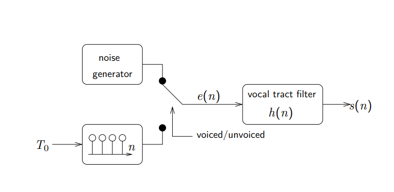

Required Parameters:
- voiced/unvoiced classification
- fundamental period T0
-  vocal tract filter

The vocal tract is modeled by the filter h(n).

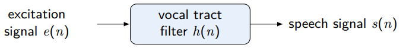

*What is the difference between formant frequency and fundamental frequency?*
*Note: Essential for passing this course*

- In the source-filter model, excitation (source) and filter (vocal tract)
are treated as being independent.
- Formants: Peaks of the spectral envelope, resonances of the vocal tract -> defines the meaning of a phone
- Fundamental frequency: first peak of the spectral fine structure,
and distance between spectral harmonics.

*What is a formant map?*

A formant map is a visual representation of the formant frequencies of speech sounds, typically vowels, plotted in a two-dimensional space. Formants are resonant frequencies of the vocal tract and are crucial in distinguishing different vowel sounds.
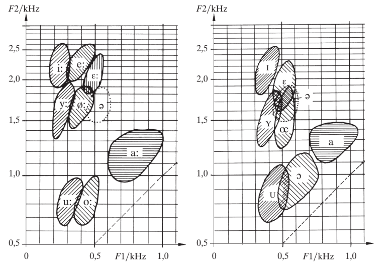

*What are the three essential parts of the human ear?*

Outer, Middel and inner ear

*Why is a spectral representation of audio signal so easy to interpret for humans?*

- **Frequency Analysis**: Humans naturally perceive sounds in terms of frequency. The human ear and brain are adept at distinguishing different frequencies, making spectral representation intuitive.
  
- **Visual Clarity**: Spectral representation separates complex audio signals into their constituent frequencies, making it easier to identify patterns, harmonics, and noise components visually.

- **Speech and Music**: Spectral representation highlights the fundamental frequencies and harmonics of speech and music, which are critical for understanding and appreciating these sounds.

- **Noise Identification**: Spectral representation helps in identifying and isolating noise components from desired signals, which is essential in audio processing and enhancement.

- **Temporal Changes**: Spectrograms, which are time-frequency representations, allow for the visualization of how the spectral content of a signal changes over time, providing a comprehensive view of dynamic audio signals.

- **Natural Resonances**: The human vocal tract and musical instruments produce sounds with characteristic resonances and formants that are easily visible in a spectral representation, aiding in analysis and synthesis.

- **Technical Applications**: Engineers and scientists use spectral representations to design filters, analyze system behavior, and develop audio compression algorithms, leveraging the clear and detailed information provided by the spectrum.

## Fundamental Frequency Estimation
**Periodicity in speech signals**

  | Unvoiced Speech           | Voiced Speech                |
  |---------------------------|------------------------------|
  | ■ noise excitation        | ■ periodic glottis excitation|
  | ■ pitch not available     | ■ pitch available            |

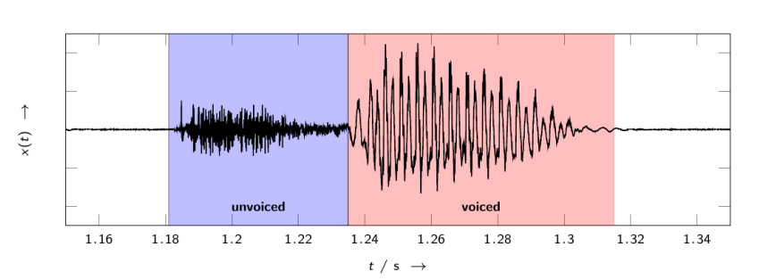

*What is a typical range for the fundamental frequency of humans?*

**Fundamental frequency:** 40 Hz – 600 Hz (600 Hz for
children)
 
*What are average fundamental frequencies for female and male speakers, respectively?*

<u> male speakers:</u> around 100Hz; 
<u>female speakers:</u> around 200Hz

*How is it possible to distinguish female from male speakers in narrowband telephony?*

■ Narrowband telephone speech is bandpass filtered between 300 Hz and
3400 Hz (“telephone voice”)

*How can the fundamental frequency of phones be measured?*

Simple solution: Distance between peaks (or zero-crossing before the
peaks) in the time-domain

Better: autocorrelation-base
Let $ x(n) $ denote a realization of a random process

- **Autocorrelation function**
  $$ \phi_{XX}(\lambda) = E(x(n)x^*(n + \lambda)) = \int_{-\infty}^{\infty} \int_{-\infty}^{\infty} u v p_{x(n),x^*(n+\lambda)}(u, v) \, du \, dv $$

- The signal is shifted against itself → measure of self-similarity

- Estimation for a quasi-stationary segment of length $ N $ for lag $ \lambda > 0 $
  $$ \hat{\phi}_{xx}(\lambda) = \frac{1}{N - |\lambda|} \sum_{n=0}^{N - |\lambda| - 1} x(n)x^*(n + \lambda) $$

- The Fourier transform of the autocorrelation function is called power spectral density (PSD)
  $$ \Phi_X(f) = \sum_{\lambda = -\infty}^{\infty} \phi_{XX}(\lambda) e^{-j\Omega\lambda} $$

The peak next to the lag λ = 0 of the autocorrelation function
corresponds to the fundamental period T0.
First peak in the fine structure of the spectrum corresponds to the
speech fundamental frequency f0 = 1/T0.

*How would you choose the segment/window length when estimating the varying fundamental frequency of speech? What is the trade-off?*

The window length must be carefully chosen
- The more periods fit into a window, the more robust the
estimation (the larger the window, the better)
- The speech fundamental frequency changes over time (the shorter
the window, the better)
- ≈ 30 ms is a good compromise (3 periods at f0 = 100 Hz)

## Spectral Analysis of Audio Signals

For speech signals, useful spectral representations are
- Short-time (discrete) Fourier transform (DFT, STFT)
- Short-time (discrete) Cosine transform (DCT)
- Eigenvalue/eigenvector decomposition (Karhunen-Loève transform,
KLT)
- (Generalized) singular value decomposition (SVD, GSVD)
- Filter bank coefficients
- Wavelet transform coefficients
- Parametric model coefficients: autoregressive parameters (LPC),
reflection coefficients, log-area ratios, cepstral coefficients, Line
Spectral Frequencies (LSF), mel-frequency cepstral coefficients (MFCC)

*What are complex numbers and how can they be represented?*

We see that the Fourier series consists of the comparison with (1) sine and (2) cosine functions. 

It can be expressed much more elegantly by means of complex numbers:

- For many spectral transformations, complex numbers are needed.
- A complex number \( z \) is composed of a real part \( a \) and an imaginary part \( b \)
  \[
  z = \text{Re} \{z\} + j \text{Im} \{z\} = a + jb
  \]
- \( j \) is the imaginary unit and separates the real and imaginary parts.

*How are real and imaginary part related to magnitude and phase?*

A complex number \( z = a + jb \) can be represented in polar form as \( z = |z| e^{j\theta} \), where:

- \( |z| \) is the magnitude (or modulus) of the complex number.
- \( \theta \) is the phase (or argument) of the complex number.

The magnitude \( |z| \) is given by:
$$ |z| = \sqrt{a^2 + b^2} $$

The phase \( \theta \) is given by:
$$ \theta = \tan^{-1} \left( \frac{b}{a} \right) $$

The real part \( a \) and the imaginary part \( b \) can be related to the magnitude and phase as follows:
$$ a = |z| \cos(\theta) $$
$$ b = |z| \sin(\theta) $$

*What is Euler's relation?*

Euler's relation (memorize!)

$$ e^{j\phi} = \cos \phi + j\sin(\phi) $$

*For what kind of signals would you use a Fourier series analysis, and for which a Fourier transform to analyze its spectral content?*

- **Fourier Series Analysis**:
  - Used for periodic signals.
  - Breaks down a periodic signal into a sum of sine and cosine functions with discrete frequencies.
  - Examples:
    - Analyzing the harmonics in a musical note.
    - Studying the repetitive patterns in a square wave signal.

- **Fourier Transform**:
  - Used for non-periodic or aperiodic signals.
  - Transforms a signal from the time domain to the frequency domain, providing a continuous spectrum of frequencies.
  - Examples:
    - Analyzing the frequency content of a speech signal.
    - Studying transient signals like an impulse or a shock wave.

*Fourier transform pairs: What is the Fourier transform of*

**an Impulse?**
- Time Domain: The impulse or delta function 𝛿(𝑡) is represented as a spike at 𝑡=0
- Frequency Domain: Its Fourier transform is a constant function across all frequencies, indicating that an impulse contains all frequencies equally.

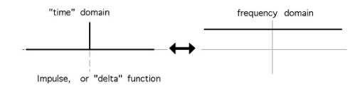

**a rectangular function?**
- Time Domain: The rectangular function rect(t) is represented as a box or rectangle with width 
𝑑.
- Frequency Domain: Its Fourier transform is a sinc function, indicating that a rectangular time-domain signal has a sinc-shaped frequency spectrum.
 
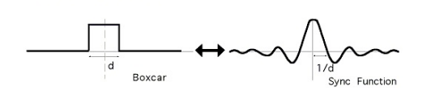

**a sinusoid?**
  -Time Domain: The sinusoidcos(ω0t) is represented as a continuous wave oscillating with period 
𝑇.
- Frequency Domain: Its Fourier transform consists of two delta functions at ±ω 0, indicating that a sinusoid corresponds to a single frequency component.

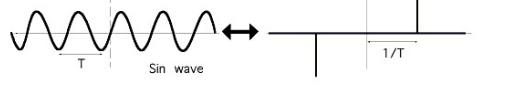

**a delta comb?**
- Time Domain: The delta comb is a series of delta functions spaced by T in the time domain.
- Frequency Domain: Its Fourier transform is another delta comb with spacing 
1/𝑇 in the frequency domain, indicating periodicity in time results in discrete frequency components.

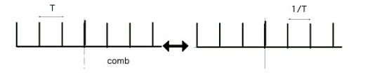

**a periodic signal like a sawtooth signal (qualitatively)?**

steht nichts in der Vorlesung

*What is a linear time-invariant (LTI) system? Give examples.*

A **linear time-invariant (LTI) system** is a system in signal processing and control theory that satisfies two key properties:

1. **Linearity**:
   - The principle of superposition applies. This means that the response caused by two or more stimuli is the sum of the responses that would have been caused by each stimulus individually.
   - Mathematically, if the system's response to \( x_1(t) \) is \( y_1(t) \) and the response to \( x_2(t) \) is \( y_2(t) \), then the response to \( a_1 x_1(t) + a_2 x_2(t) \) is \( a_1 y_1(t) + a_2 y_2(t) \), where \( a_1 \) and \( a_2 \) are constants.

2. **Time-Invariance**:
   - The system's properties do not change over time. If the input signal is shifted in time, the output is shifted by the same amount.
   - Mathematically, if the system's response to \( x(t) \) is \( y(t) \), then the response to \( x(t - t_0) \) is \( y(t - t_0) \).

### Examples:

1. **Electrical Circuits**:
   - An RC (resistor-capacitor) circuit is a classic example of an LTI system. The voltage across the capacitor in response to an input voltage can be described by linear differential equations, and its behavior does not change over time.

2. **Mechanical Systems**:
   - A mass-spring-damper system is an LTI system where the force applied to the mass results in a displacement. The relationship between force and displacement (or velocity) is linear, and the system properties (mass, damping coefficient, spring constant) are time-invariant.

3. **Digital Filters**:
   - A digital FIR (Finite Impulse Response) filter is an example of an LTI system in the discrete domain. The filter's output is a linear combination of current and past input values, and the filter coefficients do not change over time.

4. **Acoustic Systems**:
   - A room's acoustic response to a sound source can be modeled as an LTI system. The way sound reflects off the walls and reaches a listener is linear, and assuming the room's properties do not change, it is time-invariant.

### Mathematical Representation:

An LTI system can be described using convolution:
$$
y(t) = x(t) * h(t) = \int_{-\infty}^{\infty} x(\tau) h(t - \tau) \, d\tau
$$
where \( x(t) \) is the input, \( y(t) \) is the output, and \( h(t) \) is the system's impulse response.

In the frequency domain, an LTI system is characterized by its transfer function \( H(\omega) \), which is the Fourier transform of the impulse response \( h(t) \):
$$
Y(\omega) = H(\omega) X(\omega)
$$
where \( X(\omega) \) and \( Y(\omega) \) are the Fourier transforms of the input and output signals, respectively.

*How can the relation between the input and the output of an LTI system be mathematically described in time and frequency domain, respectively?*

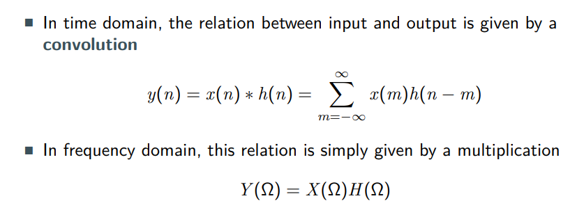

*How does a discretization of the time domain signal affect its spectrum?*

When a continuous-time signal is discretized, it is sampled at regular intervals. This means that instead of having a value for every possible point in time, we only have values at specific, evenly spaced points.

- **Aliasing**: When a continuous time-domain signal is sampled discretely, frequencies higher than half the sampling rate (Nyquist frequency) are folded back into the lower frequencies, causing distortion known as aliasing.
- **Spectral Replication**: The spectrum of the discrete signal becomes periodic with period equal to the sampling rate. This means the original spectrum is replicated at intervals of the sampling frequency.
- **Loss of High-Frequency Information**: If the sampling rate is not high enough, high-frequency components of the original signal can be lost or misrepresented.

### Mathematical Representation:
Given a continuous signal \( x(t) \) sampled at intervals \( T \), the discrete signal \( x[n] = x(nT) \). The Discrete-Time Fourier Transform (DTFT) of \( x[n] \) is:
$$
X(e^{j\omega}) = \sum_{n=-\infty}^{\infty} x[n] e^{-j\omega n}
$$
This spectrum is periodic with period \( 2\pi \).

*How does a discretization of the spectrum of a signal affect its time-domain representation?*

When a continuous frequency spectrum is discretized, it is sampled at specific frequency intervals. This can happen, for example, when performing a Discrete Fourier Transform (DFT).

- **Periodicity in Time Domain**: Discretizing the spectrum of a signal (as in sampling in the frequency domain) causes the time-domain signal to become periodic. The period of this repetition is the inverse of the spacing between the discrete frequency samples.
- **Truncation Effects**: If the spectrum is truncated (i.e., not all frequency components are included), this causes the time-domain signal to be smoothed, which can lead to loss of detail or distortion.

### Mathematical Representation:
Given a continuous spectrum \( X(f) \) sampled at intervals \( \Delta f \), the inverse Fourier transform provides a time-domain signal that repeats with period \( \frac{1}{\Delta f} \):
$$
x(t) = \sum_{k=-\infty}^{\infty} X(k\Delta f) e^{j 2\pi k \Delta f t}
$$

*Explain the sampling theorem*

The **sampling theorem**, also known as the **Nyquist-Shannon sampling theorem**, is a fundamental principle in the field of digital signal processing. It defines the conditions under which a continuous signal can be sampled and perfectly reconstructed from its samples. The theorem states:

- **Statement**: A continuous-time signal that has been band-limited to a maximum frequency \( f_{\text{max}} \) can be completely represented and perfectly reconstructed from its samples if the sampling rate \( f_s \) is greater than twice the maximum frequency \( f_{\text{max}} \).

*What are typical sampling rates for speech and audio signals, respectively? Why?*

*What are typical sampling rates for speech and audio signals, respectively? Why?*
- **Speech Signals**: Typically sampled at 8 kHz or 16 kHz to balance quality and bandwidth.
- **Audio Signals**: Typically sampled at 44.1 kHz for high-quality audio, with higher rates used in professional applications to ensure maximum fidelity and flexibility in post-production.

These sampling rates are chosen based on the Nyquist-Shannon sampling theorem to ensure accurate capture and reproduction of the respective frequency ranges of speech and audio signals.

*What is cyclic convolution, and how can it be avoided?*

(N = 8)
- However, multiplying two DFT coefficient sets of length N results in a
cyclic convolution with period N in the time domain.

- Here N is chosen such that it equals the sum of nonzero entries minus
one, i.e. N = 7 + 4 − 1 = 10.
- Cyclic convolution artifacts can be avoided by zero-padding!

*What are the pros and cons for tapered spectral analysis windows, like a Hann windows, when compared to a rectangular window?*

- The choice of the windowing function is a trade-off between spectral
resolution and spectral leakage
- Rectangular (boxcar) window
- Fourier transform is a Sinc-function
- Narrow main-lobe good frequency resolution
- Large side-lobes spectral leakage (bad)
- Tapered windows (Hann, Hamming, ...)
- Main-lobe wider than for Rectangular window slightly decreased
frequency resolution
- lower side-lobes less spectral leakage (good)
- Usually the preferred choice!

*What is the difference between a wideband and a narrowband spectrogram wrt the visible properties of speech signals?*

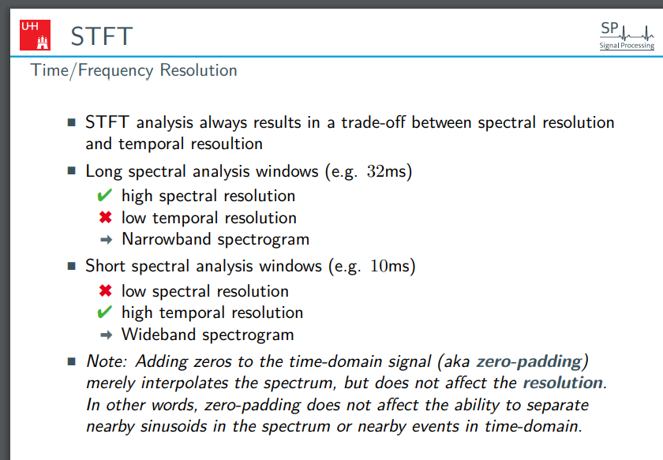

*How is a time delay by one sample represented in the z-domain?*

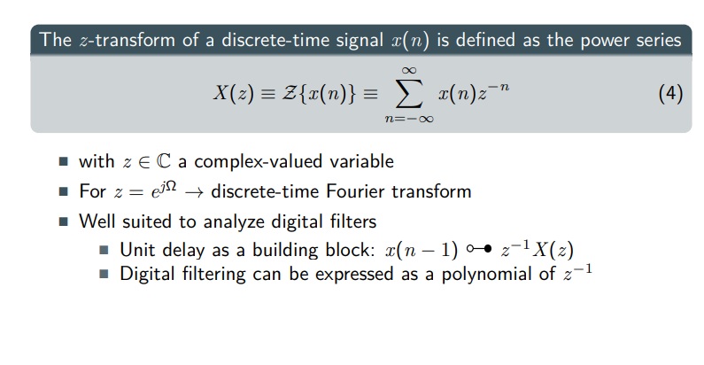

## Vocal Tract Model and Linear Prediction

*Sketch and explain the source-filter model*

simple model of the vocal tract: 

*How many Formants do we expect in speech signals per kHz? How many in a speech signal sampled at 16kHz?*

- Speech sounds:
  - voiced: periodic opening and closing of the vocal cords →
fundamental period T0,
  - unvoiced: open vocal cords, constriction somewhere in the vocal
tract,
- Resonances of the vocal tract result in peaks in the spectral envelope of
speech sounds (Formants).
- Different resonance frequencies result in different meanings of an
utterance

**Rule of thumb:**
”One resonance/ format per kHz“.

That means with a signal sampled at 16kHz, where the Nyquist Frequency is 8kHz. So 8 

*How is the Kelly-Lochbaum structure related to the tube model of the vocal tract?*

*How is the Kelly-Lochbaum structure related to digital filtering?*

*What's the difference between the fundamental frequency and the formant frequency?*

*How can a system with an infinite impulse response be described with a finite amount of parameters?*

*What is a moving average system? How is it related to an all-zero system?*

*What is an autoregressive system? How is it related to an all-pole system?*

*What are linear predictive coefficients?*

*Why are they called "linear predictive"? What is predicted?*

*How are they derived?*

*How are LPC coefficients computed from a speech signal?*

*How many LPC coefficients do I need to model a speech signal? What does it depend on?*

*What is Pre-Emphasis? Why is it important?*

## Sampling, Quantization and Speech Coding

*What steps are necessary to digitize an analog signal?*

*Explain the sampling theorem graphically in the time and frequency domain*

*What is a Midrise Characteristic?*

*Why does the SNR suddenly drop if the signal power PS is large?*

*What is a companding scheme, and why is it used?*

*What is adaptive quantization?*

*What is vector quantization?*

*Name three fundamental speech coding schemes, along with their benefits and drawbacks*

*What coding scheme has been used in ISDN telephony and DECT telephony, and what are the datarates?*

## Cepstral Analysis

*In time domain, we have the signal model s(n)=h(n)∗e(n) with h(n) the impulse response of the vocal tract and e(n) the excitation signal. How does this signal model look in the cepstral domain*

*Is the complex cepstrum complex-valued?*

*How can we estimate the spectral envelope caused by the vocal tract from the cepstral representation?*

*How can we estimate the speech fundamental frequency in the cepstral domain?*

*Explain the meaning of the terms: Cepstrum, Quefrency, Liftering, Rahmonic*

## Speech Enhancement

*How is the Wiener Filter defined in the STFT domain?*

*Explain how the Wiener Filter works in the STFT?*

*Sketch the derivation of the Wiener Filter*

*How are posterior, likelihood and prior defined in Bayesian estimation?*

*How can I find a Bayesian MMSE estimator of clean speech?*

*Explain different methods to estimate the speech variances*

*Explain different methods to estimate the noise variances*

*What is the key advantage when multiple microphones are present?*

*Name and explain two different beamformers*

*What is the key advantage of an MVDR beamformer over a delay-and-sum beamformer?*
