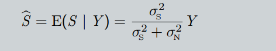

Hier sind die gesammelten Fragen aus den bereitgestellten PDFs, zusammen mit der Häufigkeit jeder Frage:

### Fragen und Häufigkeiten

1. **Source-Filter Model**
   - Skizziere und erkläre das Source-Filter-Modell.
     - **Häufigkeit**: 7 Mal
   - Was sind die Parameter des Source-Filter-Modells?
     - **Häufigkeit**: 2 Mal
   - Formel für den Filterausgang. Konvolution.
     - **Häufigkeit**: 2 Mal

2. **Voiced/Unvoiced Sounds**
   - Was bedeutet voiced/unvoiced? Gib Beispiele.
     - **Häufigkeit**: 3 Mal
   - Skizziere das Spektrum eines stimmhaften Sprachsegments und erkläre die spektralen Eigenschaften.
     - **Häufigkeit**: 4 Mal

3. **LPC (Linear Predictive Coding)**
   - Was ist LPC und wofür wird es verwendet? Erkläre den Begriff.
     - **Häufigkeit**: 3 Mal
   - Wie werden die optimalen Koeffizienten berechnet?
     - **Häufigkeit**: 3 Mal

4. **Quantisierung**
   - Erkläre den Prozess der Quantisierung. 
     - **Häufigkeit**: 3 Mal
   - Welche Typen der Quantisierung gibt es?
     - **Häufigkeit**: 2 Mal
   - Was ist adaptives Quantisieren? Gib eine kurze Erklärung.
     - **Häufigkeit**: 2 Mal

5. **Sampling**
   - Was ist das Abtasttheorem? Erkläre es.
     - **Häufigkeit**: 2 Mal
   - Erkläre den Prozess der Digitalisierung eines analogen Signals.
     - **Häufigkeit**: 2 Mal

6. **Speech Enhancement**
   - Wie funktioniert Sprachverbesserung? Wie leiten wir den Wiener Filter her?
     - **Häufigkeit**: 3 Mal
   - Schreibe die Gleichung für den Wiener Filter auf und erkläre sie.
     - **Häufigkeit**: 3 Mal

7. **ARMA-Modell (AutoRegressive Moving Average)**
   - Schreibe die Differentialgleichung für das ARMA-Modell auf.
     - **Häufigkeit**: 2 Mal
   - Wie wird das ARMA-Modell aus dem Source-Filter-Modell abgeleitet?
     - **Häufigkeit**: 2 Mal

8. **Autokorrelation**
   - Wie werden die Autokorrelationswerte berechnet? Wie wird die Autokorrelation definiert?
     - **Häufigkeit**: 2 Mal

9. **Beamforming**
   - Nenne zwei Arten von Beamforming und erkläre eine.
     - **Häufigkeit**: 2 Mal

### Weitere Einzelheiten:

- Die Fragen zur Transformation von Zeit- zu Frequenzbereich (z.B. durch z-Transformation) kommen mehrfach vor, oft im Zusammenhang mit dem Source-Filter-Modell.
- Häufig gestellte theoretische Fragen umfassen die Bedeutung von formants, fundamentaler Frequenz, und den Mechanismen der Sprachproduktion.
- Spezifische Fragen zur Nutzung und Berechnung von LPC-Koeffizienten sowie die Anwendung in verschiedenen Kontexten (z.B. Sprachcodierung) werden regelmäßig thematisiert.
- Es gibt häufig Fragen zu den Details und mathematischen Hintergründen von Sampling und Quantisierung, inklusive der SNR-Berechnung und ihrer praktischen Bedeutung.

Falls du detailliertere Informationen zu bestimmten Fragen oder Themen benötigst, lass es mich wissen!

# Questions

## Introduction

*What are the most important classes of speech sounds?*

voiced sounds
- vowels (a,e,i,o,u)
- sounds with mixed excitation (/v/)

unvoiced sounds
- fricative (/s/,/th/,/sh/)
- plosive (/k/,/p/,/t/)

*What is the difference between a phone and a phoneme? What is an allophone?*

- **Phone**: Smallest speech segment with distinct physical or perceptual properties.
  - **Example**: The sound [p] in the words "pat" and "spat" are two instances of the same phone.

- **Phoneme**: The smallest contrastive linguistic unit which may bring about a change of meaning. One phoneme consists of a set of phones that are thought of as the same element within the phonology of a particular language (→ allophones).
  - **Example**: The phoneme /p/ in English can change the meaning of a word, as in "pat" vs. "bat".

- **Allophone**: One phone of the many that constitute a phoneme.
  - **Example**: The [p] sound in "pat" (aspirated) and the [p] sound in "spat" (unaspirated) are allophones of the phoneme /p/ in English.

*How can phones be categorized into an international phonetic alphabet?*

Phonemes are characterized by the way of articulation
- Vowel
- Nasal
- Fricative
- Plosive

*What comprises prosody?*

Rhythm, stress, and intonation of speech
- Reflects
  - Emotional state of the speaker
  - Form of the utterance (statement, question, or command)
  - Irony or sarcasm
  - Emphasis, contrast, and focus

Remark: Often, only the intonation is meant when we say 'prosody'. However, intonation is strictly speaking only part of the prosody.

*How does human speech production work?*

- Lungs produce air flow
- In the larynx (Kehlkopf) the vocal cords start vibrating and produce sound
- In the vocal tract, the sound is formed to produce a speech sound.

*How can human speech production be modeled in a simplified framework?*

**Source-Filter Model**

Source: air flow, vibration of vocal cords
Filter: Shape of the vocal tract: Position of tongue, lips, palate

Required Parameters:
- voiced/unvoiced classification
- fundamental period T0
-  vocal tract filter

The vocal tract is modeled by the filter h(n).

*What is the difference between formant frequency and fundamental frequency?*
*Note: Essential for passing this course*

- In the source-filter model, excitation (source) and filter (vocal tract)
are treated as being independent.
- Formants: Peaks of the spectral envelope, resonances of the vocal tract -> defines the meaning of a phone
- Fundamental frequency: first peak of the spectral fine structure,
and distance between spectral harmonics.

*What is a formant map?*

A formant map is a visual representation of the formant frequencies of speech sounds, typically vowels, plotted in a two-dimensional space. Formants are resonant frequencies of the vocal tract and are crucial in distinguishing different vowel sounds.

*What are the three essential parts of the human ear?*

Outer, Middel and inner ear

*Why is a spectral representation of audio signal so easy to interpret for humans?*

- **Frequency Analysis**: Humans naturally perceive sounds in terms of frequency. The human ear and brain are adept at distinguishing different frequencies, making spectral representation intuitive.
  
- **Visual Clarity**: Spectral representation separates complex audio signals into their constituent frequencies, making it easier to identify patterns, harmonics, and noise components visually.

- **Speech and Music**: Spectral representation highlights the fundamental frequencies and harmonics of speech and music, which are critical for understanding and appreciating these sounds.

- **Noise Identification**: Spectral representation helps in identifying and isolating noise components from desired signals, which is essential in audio processing and enhancement.

- **Temporal Changes**: Spectrograms, which are time-frequency representations, allow for the visualization of how the spectral content of a signal changes over time, providing a comprehensive view of dynamic audio signals.

- **Natural Resonances**: The human vocal tract and musical instruments produce sounds with characteristic resonances and formants that are easily visible in a spectral representation, aiding in analysis and synthesis.

- **Technical Applications**: Engineers and scientists use spectral representations to design filters, analyze system behavior, and develop audio compression algorithms, leveraging the clear and detailed information provided by the spectrum.

## Fundamental Frequency Estimation
**Periodicity in speech signals**

  | Unvoiced Speech           | Voiced Speech                |
  |---------------------------|------------------------------|
  | ■ noise excitation        | ■ periodic glottis excitation|
  | ■ pitch not available     | ■ pitch available            |

*What is a typical range for the fundamental frequency of humans?*

**Fundamental frequency:** 40 Hz – 600 Hz (600 Hz for
children)
 
*What are average fundamental frequencies for female and male speakers, respectively?*

<u> male speakers:</u> around 100Hz; 
<u>female speakers:</u> around 200Hz

*How is it possible to distinguish female from male speakers in narrowband telephony?*

■ Narrowband telephone speech is bandpass filtered between 300 Hz and
3400 Hz (“telephone voice”)

*How can the fundamental frequency of phones be measured?*

Simple solution: Distance between peaks (or zero-crossing before the
peaks) in the time-domain

Better: autocorrelation-base
Let $ x(n) $ denote a realization of a random process

- **Autocorrelation function**
  $$ \phi_{XX}(\lambda) = E(x(n)x^*(n + \lambda)) = \int_{-\infty}^{\infty} \int_{-\infty}^{\infty} u v p_{x(n),x^*(n+\lambda)}(u, v) \, du \, dv $$

- The signal is shifted against itself → measure of self-similarity

- Estimation for a quasi-stationary segment of length $ N $ for lag $ \lambda > 0 $
  $$ \hat{\phi}_{xx}(\lambda) = \frac{1}{N - |\lambda|} \sum_{n=0}^{N - |\lambda| - 1} x(n)x^*(n + \lambda) $$

- The Fourier transform of the autocorrelation function is called power spectral density (PSD)
  $$ \Phi_X(f) = \sum_{\lambda = -\infty}^{\infty} \phi_{XX}(\lambda) e^{-j\Omega\lambda} $$

The peak next to the lag λ = 0 of the autocorrelation function
corresponds to the fundamental period T0.
First peak in the fine structure of the spectrum corresponds to the
speech fundamental frequency f0 = 1/T0.

*How would you choose the segment/window length when estimating the varying fundamental frequency of speech? What is the trade-off?*

The window length must be carefully chosen
- The more periods fit into a window, the more robust the
estimation (the larger the window, the better)
- The speech fundamental frequency changes over time (the shorter
the window, the better)
- ≈ 30 ms is a good compromise (3 periods at f0 = 100 Hz)

## Spectral Analysis of Audio Signals

For speech signals, useful spectral representations are
- Short-time (discrete) Fourier transform (DFT, STFT)
- Short-time (discrete) Cosine transform (DCT)
- Eigenvalue/eigenvector decomposition (Karhunen-Loève transform,
KLT)
- (Generalized) singular value decomposition (SVD, GSVD)
- Filter bank coefficients
- Wavelet transform coefficients
- Parametric model coefficients: autoregressive parameters (LPC),
reflection coefficients, log-area ratios, cepstral coefficients, Line
Spectral Frequencies (LSF), mel-frequency cepstral coefficients (MFCC)

*What are complex numbers and how can they be represented?*

We see that the Fourier series consists of the comparison with (1) sine and (2) cosine functions. 

It can be expressed much more elegantly by means of complex numbers:

- For many spectral transformations, complex numbers are needed.
- A complex number \( z \) is composed of a real part \( a \) and an imaginary part \( b \)
  \[
  z = \text{Re} \{z\} + j \text{Im} \{z\} = a + jb
  \]
- \( j \) is the imaginary unit and separates the real and imaginary parts.

*How are real and imaginary part related to magnitude and phase?*

A complex number \( z = a + jb \) can be represented in polar form as \( z = |z| e^{j\theta} \), where:

- \( |z| \) is the magnitude (or modulus) of the complex number.
- \( \theta \) is the phase (or argument) of the complex number.

The magnitude \( |z| \) is given by:
$$ |z| = \sqrt{a^2 + b^2} $$

The phase \( \theta \) is given by:
$$ \theta = \tan^{-1} \left( \frac{b}{a} \right) $$

The real part \( a \) and the imaginary part \( b \) can be related to the magnitude and phase as follows:
$$ a = |z| \cos(\theta) $$
$$ b = |z| \sin(\theta) $$

*What is Euler's relation?*

Euler's relation (memorize!)

$$ e^{j\phi} = \cos \phi + j\sin(\phi) $$

*For what kind of signals would you use a Fourier series analysis, and for which a Fourier transform to analyze its spectral content?*

- **Fourier Series Analysis**:
  - Used for periodic signals.
  - Breaks down a periodic signal into a sum of sine and cosine functions with discrete frequencies.
  - Examples:
    - Analyzing the harmonics in a musical note.
    - Studying the repetitive patterns in a square wave signal.

- **Fourier Transform**:
  - Used for non-periodic or aperiodic signals.
  - Transforms a signal from the time domain to the frequency domain, providing a continuous spectrum of frequencies.
  - Examples:
    - Analyzing the frequency content of a speech signal.
    - Studying transient signals like an impulse or a shock wave.

*Fourier transform pairs: What is the Fourier transform of*

**an Impulse?**
- Time Domain: The impulse or delta function 𝛿(𝑡) is represented as a spike at 𝑡=0
- Frequency Domain: Its Fourier transform is a constant function across all frequencies, indicating that an impulse contains all frequencies equally.

**a rectangular function?**
- Time Domain: The rectangular function rect(t) is represented as a box or rectangle with width 
𝑑.
- Frequency Domain: Its Fourier transform is a sinc function, indicating that a rectangular time-domain signal has a sinc-shaped frequency spectrum.
 

**a sinusoid?**
  -Time Domain: The sinusoidcos(ω0t) is represented as a continuous wave oscillating with period 
𝑇.
- Frequency Domain: Its Fourier transform consists of two delta functions at ±ω 0, indicating that a sinusoid corresponds to a single frequency component.

**a delta comb?**
- Time Domain: The delta comb is a series of delta functions spaced by T in the time domain.
- Frequency Domain: Its Fourier transform is another delta comb with spacing 
1/𝑇 in the frequency domain, indicating periodicity in time results in discrete frequency components.

**a periodic signal like a sawtooth signal (qualitatively)?**

steht nichts in der Vorlesung

*What is a linear time-invariant (LTI) system? Give examples.*

A **linear time-invariant (LTI) system** is a system in signal processing and control theory that satisfies two key properties:

1. **Linearity**:
   - The principle of superposition applies. This means that the response caused by two or more stimuli is the sum of the responses that would have been caused by each stimulus individually.
   - Mathematically, if the system's response to \( x_1(t) \) is \( y_1(t) \) and the response to \( x_2(t) \) is \( y_2(t) \), then the response to \( a_1 x_1(t) + a_2 x_2(t) \) is \( a_1 y_1(t) + a_2 y_2(t) \), where \( a_1 \) and \( a_2 \) are constants.

2. **Time-Invariance**:
   - The system's properties do not change over time. If the input signal is shifted in time, the output is shifted by the same amount.
   - Mathematically, if the system's response to \( x(t) \) is \( y(t) \), then the response to \( x(t - t_0) \) is \( y(t - t_0) \).

### Examples:

1. **Electrical Circuits**:
   - An RC (resistor-capacitor) circuit is a classic example of an LTI system. The voltage across the capacitor in response to an input voltage can be described by linear differential equations, and its behavior does not change over time.

2. **Mechanical Systems**:
   - A mass-spring-damper system is an LTI system where the force applied to the mass results in a displacement. The relationship between force and displacement (or velocity) is linear, and the system properties (mass, damping coefficient, spring constant) are time-invariant.

3. **Digital Filters**:
   - A digital FIR (Finite Impulse Response) filter is an example of an LTI system in the discrete domain. The filter's output is a linear combination of current and past input values, and the filter coefficients do not change over time.

4. **Acoustic Systems**:
   - A room's acoustic response to a sound source can be modeled as an LTI system. The way sound reflects off the walls and reaches a listener is linear, and assuming the room's properties do not change, it is time-invariant.

### Mathematical Representation:

An LTI system can be described using convolution:
$$
y(t) = x(t) * h(t) = \int_{-\infty}^{\infty} x(\tau) h(t - \tau) \, d\tau
$$
where \( x(t) \) is the input, \( y(t) \) is the output, and \( h(t) \) is the system's impulse response.

In the frequency domain, an LTI system is characterized by its transfer function \( H(\omega) \), which is the Fourier transform of the impulse response \( h(t) \):
$$
Y(\omega) = H(\omega) X(\omega)
$$
where \( X(\omega) \) and \( Y(\omega) \) are the Fourier transforms of the input and output signals, respectively.

*How can the relation between the input and the output of an LTI system be mathematically described in time and frequency domain, respectively?*

*How does a discretization of the time domain signal affect its spectrum?*

When a continuous-time signal is discretized, it is sampled at regular intervals. This means that instead of having a value for every possible point in time, we only have values at specific, evenly spaced points.

- **Aliasing**: When a continuous time-domain signal is sampled discretely, frequencies higher than half the sampling rate (Nyquist frequency) are folded back into the lower frequencies, causing distortion known as aliasing.
- **Spectral Replication**: The spectrum of the discrete signal becomes periodic with period equal to the sampling rate. This means the original spectrum is replicated at intervals of the sampling frequency.
- **Loss of High-Frequency Information**: If the sampling rate is not high enough, high-frequency components of the original signal can be lost or misrepresented.

### Mathematical Representation:
Given a continuous signal \( x(t) \) sampled at intervals \( T \), the discrete signal \( x[n] = x(nT) \). The Discrete-Time Fourier Transform (DTFT) of \( x[n] \) is:
$$
X(e^{j\omega}) = \sum_{n=-\infty}^{\infty} x[n] e^{-j\omega n}
$$
This spectrum is periodic with period \( 2\pi \).

*How does a discretization of the spectrum of a signal affect its time-domain representation?*

When a continuous frequency spectrum is discretized, it is sampled at specific frequency intervals. This can happen, for example, when performing a Discrete Fourier Transform (DFT).

- **Periodicity in Time Domain**: Discretizing the spectrum of a signal (as in sampling in the frequency domain) causes the time-domain signal to become periodic. The period of this repetition is the inverse of the spacing between the discrete frequency samples.
- **Truncation Effects**: If the spectrum is truncated (i.e., not all frequency components are included), this causes the time-domain signal to be smoothed, which can lead to loss of detail or distortion.

### Mathematical Representation:
Given a continuous spectrum \( X(f) \) sampled at intervals \( \Delta f \), the inverse Fourier transform provides a time-domain signal that repeats with period \( \frac{1}{\Delta f} \):
$$
x(t) = \sum_{k=-\infty}^{\infty} X(k\Delta f) e^{j 2\pi k \Delta f t}
$$

*Explain the sampling theorem*

The **sampling theorem**, also known as the **Nyquist-Shannon sampling theorem**, is a fundamental principle in the field of digital signal processing. It defines the conditions under which a continuous signal can be sampled and perfectly reconstructed from its samples. The theorem states:

- **Statement**: A continuous-time signal that has been band-limited to a maximum frequency \( f_{\text{max}} \) can be completely represented and perfectly reconstructed from its samples if the sampling rate \( f_s \) is greater than twice the maximum frequency \( f_{\text{max}} \).

*What are typical sampling rates for speech and audio signals, respectively? Why?*

*What are typical sampling rates for speech and audio signals, respectively? Why?*
- **Speech Signals**: Typically sampled at 8 kHz or 16 kHz to balance quality and bandwidth.
- **Audio Signals**: Typically sampled at 44.1 kHz for high-quality audio, with higher rates used in professional applications to ensure maximum fidelity and flexibility in post-production.

These sampling rates are chosen based on the Nyquist-Shannon sampling theorem to ensure accurate capture and reproduction of the respective frequency ranges of speech and audio signals.

*What is cyclic convolution, and how can it be avoided?*

(N = 8)
- However, multiplying two DFT coefficient sets of length N results in a
cyclic convolution with period N in the time domain.

- Here N is chosen such that it equals the sum of nonzero entries minus
one, i.e. N = 7 + 4 − 1 = 10.
- Cyclic convolution artifacts can be avoided by zero-padding!

*What are the pros and cons for tapered spectral analysis windows, like a Hann windows, when compared to a rectangular window?*

- The choice of the windowing function is a trade-off between spectral
resolution and spectral leakage
- Rectangular (boxcar) window
- Fourier transform is a Sinc-function
- Narrow main-lobe good frequency resolution
- Large side-lobes spectral leakage (bad)
- Tapered windows (Hann, Hamming, ...)
- Main-lobe wider than for Rectangular window slightly decreased
frequency resolution
- lower side-lobes less spectral leakage (good)
- Usually the preferred choice!

*What is the difference between a wideband and a narrowband spectrogram wrt the visible properties of speech signals?*

*How is a time delay by one sample represented in the z-domain?*

## Vocal Tract Model and Linear Prediction

*Sketch and explain the source-filter model*

simple model of the vocal tract: 

*How many Formants do we expect in speech signals per kHz? How many in a speech signal sampled at 16kHz?*

- Speech sounds:
  - voiced: periodic opening and closing of the vocal cords →
fundamental period T0,
  - unvoiced: open vocal cords, constriction somewhere in the vocal
tract,
- Resonances of the vocal tract result in peaks in the spectral envelope of
speech sounds (Formants).
- Different resonance frequencies result in different meanings of an
utterance

**Rule of thumb:**
”One resonance/ format per kHz“.

That means with a signal sampled at 16kHz, where the Nyquist Frequency is 8kHz. So 8 

*How is the Kelly-Lochbaum structure related to the tube model of the vocal tract?*

- the tube model is simplified just a tube from the glottis to the mouth. 
- The acoustic pressure is
  -  Maximum at the closed end
  -  zero at the open end.
- p = the acustic preasure 
- u = sound particle velocity
- v = u · A: volume velocit
- Acoustic impedance    
- Sudden changes in impedance result in reflections. Reflection factor 

 

- the Kelly-Lochbaum structure represents a model is used to simulate the acoustics of the human vocal tract. 
  - that shows the movement of the wavelength and the reflections that occur
  - This model is used to study how sound waves are generated, transmitted, and reflected within the vocal tract.

*How is the Kelly-Lochbaum structure related to digital filtering?*

The **Kelly-Lochbaum structure** is closely related to digital filtering, particularly in the context of modeling the vocal tract in speech synthesis and speech processing. 

*What's the difference between the fundamental frequency and the formant frequency?*

In the source-filter model, excitation (source) and filter (vocal tract)
are treated as being independent.
- Formants: Peaks of the spectral envelope, resonances of the vocal
tract
defines the meaning of a phone
- Fundamental frequency: first peak of the spectral fine structure,
and distance between spectral harmonics.

*How can a system with an infinite impulse response be described with a finite amount of parameters?*

The vocal tract is modeled using the impulse response h(n).

In discrete time-domain, we can describe the system by a convolution here the impulse response h(k) can be infinitely long

We can describe our system by a finite recursive equation, as

Referred to as autoregressive moving-average (ARMA) model

*What is a moving average system? How is it related to an all-zero system?*

In signal processing, a moving average (MA) system is a type of digital filter that computes the output as the average of a number of past input values. It is specifically an all-zero system because its output depends only on the current and past input values, not on past outputs.

**Moving Average (MA) System**
The general form of a moving average system can be described by the following finite recursive equation: MA in the picture before 

**All-Zero System**

An all-zero system, also known as a finite impulse response (FIR) filter, has an impulse response that is of finite duration, meaning it settles to zero in a finite number of steps.

**Relationship between MA and All-Zero Systems**

The moving average system is a special case of an all-zero system. Both can be represented by the same mathematical structure where the output depends only on a finite number of past inputs.

*What is an autoregressive system? How is it related to an all-pole system?*

An **autoregressive (AR) system** is a type of linear predictive model where the current output of the system is expressed as a linear combination of its previous outputs and a stochastic term (usually considered as an input or noise).

An **all-pole system** is a type of filter where the transfer function \( H(z) \) has only poles (no zeros), except for a possible zero at the origin. This means the output is determined solely by the past outputs and the input (or noise).

An autoregressive system is essentially an all-pole system because:

1. **Dependence on Past Outputs**:
   - In an AR system, the current output depends on past outputs, which is the characteristic feature of all-pole systems.

2. **No Zeros**:
   - The transfer function of an AR system only has poles, as shown in the denominator of the transfer function \( H(z) \). There are no zeros in the numerator, which aligns with the definition of an all-pole system.

3. **Impulse Response**:
   - The impulse response of an AR system is theoretically infinite, as the system output depends recursively on previous outputs. This is typical of all-pole systems.

*What are linear predictive coefficients?*

Linear Predictive Coefficients (LPCs) are parameters used in linear predictive coding (LPC) to represent the spectral envelope of a digital signal of speech in a compressed form. They are derived from the linear predictive model, which predicts the current sample of a signal as a linear combination of past samples.

**Purpose**:
   - LPCs are used to model the vocal tract in speech processing.
   - They provide a compact representation of the speech signal, useful for encoding and synthesizing speech.

*Why are they called "linear predictive"? What is predicted?*

Why "linear predictive"?

- Linear: The prediction is made using a linear combination of past values.
- Predictive: The method predicts the current value of the signal.

What is predicted?

The current sample of the speech signal s(n) is predicted based on its past samples and the LPCs.
The prediction aims to model the signal accurately by using the past information to estimate the present value.

*How are they derived?*

Ableitung fällt mir schwer. erstmal skippen

*How are LPC coefficients computed from a speech signal?*

The computation of Linear Predictive Coefficients (LPCs) from a speech signal involves the following steps:

1. **Frame Segmentation**:
   - Divide the continuous speech signal into short overlapping frames, typically 20-30 milliseconds long.

2. **Windowing**:
   - Apply a window function (e.g., Hamming window) to each frame to reduce edge effects and improve frequency resolution.

3. **Autocorrelation Calculation**:
   - For each frame, compute the autocorrelation values of the windowed speech signal:
     $$
     \phi(k) = \sum_{n=0}^{N-k-1} s(n) s(n+k)
     $$
   - Here, \( s(n) \) is the windowed speech signal, \( N \) is the length of the frame, and \( k \) is the lag.

4. **Set Up Normal Equations**:
   - Use the autocorrelation values to set up the normal equations for the LPC coefficients for an LPC model of order \( p \):
     $$
     \sum_{\nu=1}^{p} a_\nu \phi(k - \nu) = -\phi(k) \quad \text{for} \quad k = 1, 2, \ldots, p
     $$

5. **Levinson-Durbin Algorithm**:
   - Solve the normal equations using the Levinson-Durbin algorithm, an efficient recursive method for finding the LPC coefficients.

### Summary

To compute LPC coefficients from a speech signal:
1. Segment the speech signal into frames.
2. Apply a window function to each frame.
3. Calculate the autocorrelation values for each frame.
4. Set up and solve the normal equations using the Levinson-Durbin algorithm.

*How many LPC coefficients do I need to model a speech signal? What does it depend on?*

- The number of LPC coefficients p typically ranges from 10 to 16.
- The choice of p depends on the sampling rate, frequency range, speaker characteristics, application, and the desired model complexity.

General rule: 

p≈2×(Sampling Rate in kHz)+2.

*What is Pre-Emphasis? Why is it important?*

## Sampling, Quantization and Speech Coding

*What steps are necessary to digitize an analog signal?*

a) Quantization of signal samples

b) Quantization of parameters

*Explain the sampling theorem graphically in the time and frequency domain*

### Sampling Theorem

A signal can be perfectly reconstructed from its samples if the sampling rate fs= 1/T is larger than two times the largest frequency fm in the signal:

$$
f_s > 2f_m
$$
- For audio signals we usually have following sampling rates
- 44.1 kHz or 48 kHz for Music
- 8 kHz (ISDN / GSM) / 16 kHz (HD voice) / 32 kHz (HD
Voice+) for telephony

*What is a Midrise Characteristic?*

The provided diagram illustrates the concept of a midrise characteristic quantizer and its application to a sinusoidal signal.

### Midrise Characteristic:

1. **Quantization Levels (\( \hat{x} \))**:
   - Quantization levels are symmetrically distributed around zero, marked by \(\Delta x\).
   - The step size between levels is \(\Delta x\).

2. **Decision Thresholds**:
   - Decision thresholds are centered between quantization levels.
   - Each step occurs at \( \pm \Delta x / 2, \pm 3\Delta x / 2, \ldots \).

3. **Quantizer Function**:
   - The input \( x \) is mapped to the nearest quantization level \( \hat{x} \).
   - This characteristic is useful for signals with values around zero.

### Example: Sinusoid:

1. **Original Signal (\( x(n) \))**:
   - The top plot shows a continuous sinusoidal signal \( x(n) \).

2. **Quantized Signal (\( \hat{x}(n) \))**:
   - The middle plot displays the quantized version of the sinusoidal signal.
   - The quantization levels are clearly visible as discrete steps.

3. **Quantization Error (\( \hat{x}(n) - x(n) \))**:
   - The bottom plot shows the quantization error.
   - The error oscillates between \( +\Delta x / 2 \) and \( -\Delta x / 2 \), indicating the difference between the actual and quantized values.

*Why does the SNR suddenly drop if the signal power PS is large?*

Rule of thumb: SNR increases by 6 dB for each spent bit w

SNR is also dependent on the scale and distribution of the signal

Signal-to-Noise Ratio (SNR) measures the level of the desired signal relative to the level of background noise. It is often expressed in decibels (dB). A sudden drop in SNR when the signal power is large can occur due to several factors related to the non-linearities and limitations of the quantization process in analog-to-digital conversion (ADC).

*What is a companding scheme, and why is it used?*

Companding is a technique that compresses the dynamic range of a signal before transmission and expands it back to its original range at the receiver.

It involves non-linear transformations such as µ-law and A-law algorithms.

Used For:
- Improving dynamic range handling.
- Reducing quantization noise.
- Enhancing SNR.
- Efficiently using bits in digital communication.
- Meeting telecommunication standards for consistent audio quality.

By applying companding, communication systems can transmit audio signals more efficiently and with higher quality, making it a vital technique in modern signal processing.

*What is adaptive quantization?*

Adaptive Quantization dynamically adjusts the quantization levels based on the input signal characteristics.

Types:

- Forward Adaptive Quantization: Parameters are determined from a block of input data.
- Backward Adaptive Quantization: Parameters are updated based on past quantized data.

Benefits:

- Improved signal quality by reducing quantization noise.
- Efficient use of bits.
- Enhanced dynamic range handling.

*What is vector quantization?*

- Simultaneous quantization of multiple random variables.
- Comprising L variables in one vector
- x (the vector) may represent e.g. successive time-samples or LPC-coefficients
- Task: Determine class representatives, so-called centroids

Vector Quantization (VQ) involves the simultaneous quantization of multiple random variables, improving the quantization process by considering the statistical dependencies between vector elements.

Applications include signal transmission, classification of vectors, and unsupervised learning.

Advantages include reduced perceived noise and efficient data transmission by only sending the index of the closest centroid from a shared codebook.

*Name three fundamental speech coding schemes, along with their benefits and drawbacks*

### Three Fundamental Speech Coding Schemes

1. **Waveform Coding**
    - **Description**: This technique directly models the waveform of the speech signal. It includes methods like Pulse Code Modulation (PCM) and Adaptive Differential Pulse Code Modulation (ADPCM).
    - **Benefits**:
        - Simple implementation.
        - High-quality speech reproduction.
        - Effective for high bit rate coding.
    - **Drawbacks**:
        - Less efficient at low bit rates.
        - Does not exploit speech-specific properties.
    - **Example**: PCM is used in traditional telephony.

2. **Source Coding (Vocoding)**
    - **Description**: This technique models the speech production process. It includes methods like Linear Predictive Coding (LPC) and Code Excited Linear Prediction (CELP).
    - **Benefits**:
        - Efficient at low bit rates.
        - Exploits speech-specific properties, reducing redundancy.
    - **Drawbacks**:
        - More complex implementation.
        - May produce synthetic-sounding speech.
    - **Example**: CELP is used in modern voice over IP (VoIP) systems.

3. **Hybrid Coding**
    - **Description**: Combines aspects of waveform coding and source coding. It includes methods like Mixed Excitation Linear Prediction (MELP).
    - **Benefits**:
        - Balances quality and efficiency.
        - Can provide good quality at moderate bit rates.
    - **Drawbacks**:
        - More complex than either waveform or source coding alone.
    - **Example**: MELP is used in military communications.

These descriptions cover the basic ideas and trade-offs associated with each type of speech coding scheme.

*What coding scheme has been used in ISDN telephony and DECT telephony, and what are the datarates?*

### Coding Schemes Used in ISDN and DECT Telephony

#### ISDN Telephony
- **Coding Scheme:** Pulse Code Modulation (PCM) - specifically, the G.711 codec.
- **Data Rate:** 64 kbit/s

#### DECT Telephony
- **Coding Scheme:** Adaptive Differential Pulse Code Modulation (ADPCM) - specifically, the G.726 codec.
- **Data Rate:** 32 kbit/s

These schemes provide efficient encoding for telephony applications, balancing quality and bandwidth requirements.

## Speech Enhancement

*How is the Wiener Filter defined in the STFT domain?*
*Explain how the Wiener Filter works in the STFT?*

The Wiener filter is a powerful tool for denoising and enhancing signals, particularly in the context of speech processing. In the Short-Time Fourier Transform (STFT) domain, the Wiener filter operates by minimizing the mean squared error between the estimated clean signal and the actual clean signal. 

The signal model is given by:
Yk(ℓ) = Sk(ℓ) + Nk(ℓ)

The goal is to minimize the mean squared error (MMSE) between the clean speech 
 and the estimate 

*Sketch the derivation of the Wiener Filter*

schau auf den Zeltel

*How are posterior, likelihood and prior defined in Bayesian estimation?*

The prior represents the initial belief about the probability distribution of a parameter before observing any data. It encapsulates any existing knowledge or assumptions about the parameter.

The likelihood represents the probability of observing the given data under different parameter values. It measures how well the data supports different parameter values.

The posterior is the updated probability distribution of the parameter after observing the data. It combines the prior and the likelihood using Bayes' theorem.

*How can I find a Bayesian MMSE estimator of clean speech?*

The Minimum Mean Square Error (MMSE) estimator is a popular technique in Bayesian estimation for finding the most accurate estimate of a parameter by minimizing the mean square error. In the context of clean speech estimation from noisy observations, the Bayesian MMSE estimator aims to provide an optimal estimate of the clean speech signal by leveraging the probabilistic knowledge of both the signal and noise.

The Bayesian MMSE estimator is derived by minimizing the mean squared error between the clean speech and its estimate. For Gaussian-distributed speech and noise, the estimator simplifies to a form similar to the Wiener filter:

This shows that the Wiener filter is the optimal estimator under these Gaussian assumptions.

### Explain different methods to estimate the speech variances

Different methods to estimate the speech variances include:

1. **Empirical Distributions**: This method involves calculating empirical distributions of speech coefficients in the DFT-domain based on estimated speech variances. The empirical distributions can be used to estimate the speech variances more accurately by taking into account the statistical properties of the speech signal&#8203;:citation[oaicite:8]{index=8}&#8203;.
   
2. **Wiener Filter**: The Wiener filter can be used to estimate the speech power spectral density (PSD). The speech variance is derived from the power spectral density of the speech signal, which can be estimated by minimizing the mean squared error between the clean and noisy speech signals&#8203;:citation[oaicite:7]{index=7}&#8203;.

### Explain different methods to estimate the noise variances

Methods to estimate noise variances include:

1. **Voice Activity Detector (VAD)**: This method involves updating the noise power spectral density (PSD) in segments where speech is absent. A threshold on frame energy is used to detect these segments. However, it may lead to errors if noise levels change during speech activity&#8203;:citation[oaicite:6]{index=6}&#8203;.

2. **Minimum Statistics Approach**: This approach estimates the noise PSD based on the minimum statistics of the noisy signal, assuming that the noise power will occasionally dominate over the speech power in some frequency bins&#8203;:citation[oaicite:5]{index=5}&#8203;.

3. **Speech Presence Probability (SPP)**: This method involves a soft decision approach, applied per frequency bin, to estimate the noise periodogram. The noise PSD is then recursively smoothed to approximate the true noise variance&#8203;:citation[oaicite:4]{index=4}&#8203;.

### What is the key advantage when multiple microphones are present?

The key advantage of using multiple microphones is that it allows for improved signal-to-noise ratio (SNR) and better noise reduction capabilities. With multiple microphones, spatial filtering techniques such as beamforming can be used to enhance the desired speech signal and suppress noise or interference from other directions. This results in a significant improvement in the quality and intelligibility of the captured speech signal&#8203;:citation[oaicite:3]{index=3}&#8203;.

### Name and explain two different beamformers

1. **Delay-and-Sum Beamformer**: This is the simplest beamformer design, which works by delaying the signals from multiple microphones to account for the time difference of arrival of the desired signal and then summing them up. This method constructively adds the target signal while destructively adding the interference, thereby enhancing the desired signal&#8203;:citation[oaicite:2]{index=2}&#8203;.

2. **Minimum Variance Distortionless Response (MVDR) Beamformer**: The MVDR beamformer minimizes the noise power while keeping the target signal distortionless. It works by applying a beamforming filter that steers the main lobe towards the desired speaker and places nulls in the direction of interferers. This method is effective in scenarios with multiple interfering sources&#8203;:citation[oaicite:1]{index=1}&#8203;.

### What is the key advantage of an MVDR beamformer over a delay-and-sum beamformer?

The key advantage of an MVDR beamformer over a delay-and-sum beamformer is its ability to minimize noise power without distorting the target signal. The MVDR beamformer achieves better noise suppression by steering nulls towards interferers, which is particularly useful in environments with multiple sources of interference. In contrast, the delay-and-sum beamformer has limited noise reduction capabilities, especially for directional (correlated) noise sources&#8203;:citation[oaicite:0]{index=0}&#8203;.

